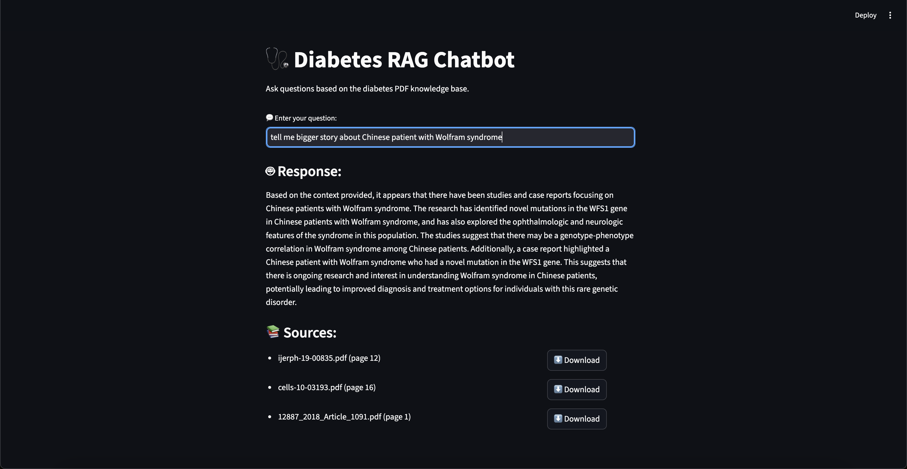

# 🩺 Diabetes RAG Chatbot  

  

A Retrieval-Augmented Generation (**RAG**) chatbot built with **LangChain**, **OpenAI**, and **ChromaDB**.
Front end part is done with a simple Streamlit page.  
The chatbot answers questions based on diabetes-related research papers downloaded from [PubMed Central](https://pmc.ncbi.nlm.nih.gov/search/?term=diabetes&sort=relevance&filter=datesearch.y_10).

You can easily replace the PDFs with your own dataset (e.g., other medical topics, legal docs, technical manuals) and rename the chatbot for your use case.  

---

## 🚀 Features
- Upload and embed **PDF documents** into a local **ChromaDB** vector database  
- Ask natural language questions about the PDFs  
- Get **context-aware answers** with **sources and page numbers**  
- Sources are shown with **downloadable PDF links**  
- Beautiful **Streamlit** UI with custom input styling  

---

## 📂 Project Structure

├── chroma/ # Local ChromaDB storage
├── data/ # Folder for your PDF files
├── .env # Store your OPENAI_API_KEY here
├── make_db.py # Script to process and index PDFs
├── query.py # Streamlit chatbot app
├── diabetes_rag_chatbot_1.png # Screenshot for README
└── README.md # Project documentation

---

## ⚙️ Installation

1. Clone this repo and navigate to the project folder:

   git clone https://github.com/Kostiantin/diabetes_rag_chatbot.git
   cd diabetes_rag_chatbot

2. Create a virtual environment (recommended):

   python -m venv venv

   source venv/bin/activate

3. Install dependencies:

   pip install langchain langchain-community langchain-openai chromadb openai pypdf python-dotenv typing-extensions streamlit

4. Create a .env file in the root folder and add your OpenAI API key:

   OPENAI_API_KEY=your_api_key_here

## 📘 Usage

1. Index PDFs

Place your diabetes-related PDFs (or any PDFs you want to use) in the data/ folder, then run:

   python make_db.py

This will process your PDFs and store embeddings in the chroma/ folder.

2. Run the Chatbot

   streamlit run query.py

3. Ask Questions

Enter your question in the chat input

The model will answer using ONLY the provided PDFs

Sources are displayed with page numbers and download buttons

🧪 Example Queries

"What are the latest treatments for type 2 diabetes?"

"What are the risk factors for gestational diabetes?"

"How does insulin resistance affect the body?"

🔧 Customization

Replace the PDFs in the data/ folder to use your own dataset

Change the Streamlit UI title and theme in query.py

Modify the PROMPT_TEMPLATE for a different answering style

## 📝 License

This project is for educational and research purposes.
Make sure to comply with the licensing terms of the documents you use.